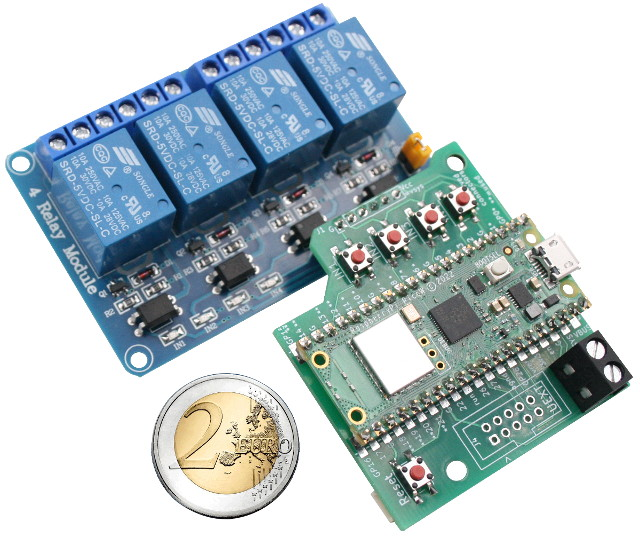
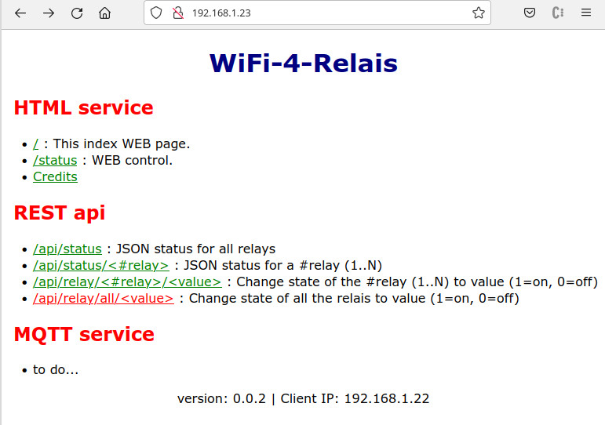
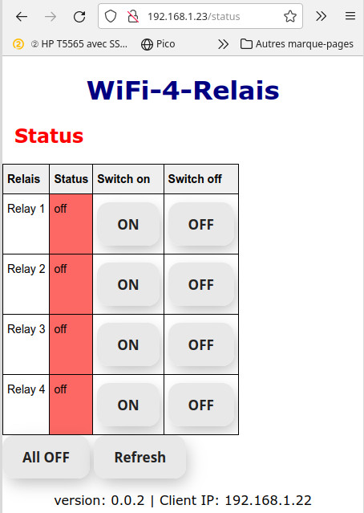
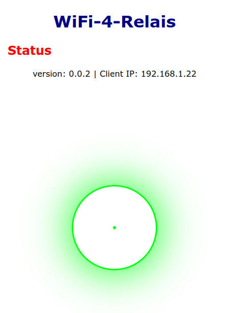
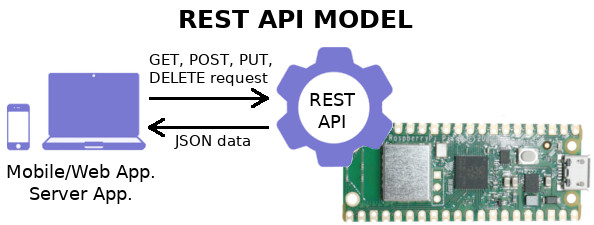
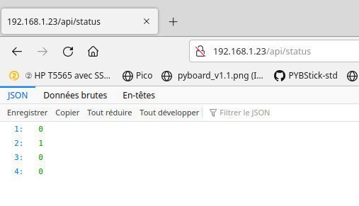
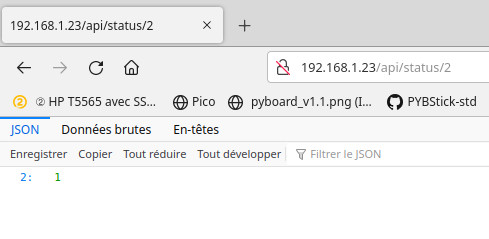

# wifi-4-relais - 4 Relay Modules + Raspberry-Pi Pico to build WiFi IoT device

This project associate a [4 relay board]() (opto-isolated) with a [Raspberry-Pico W](https://shop.mchobby.be/fr/pico-rp2040/2434-pico-w-wireless-rp2040-2-coeurs-wifi-bluetooth-3232100024342.html). Suprisingly, this setup offers a lot of possibilities.



Project features:
* Powered with [Raspberry-Pi Pico W](https://shop.mchobby.be/fr/pico-rp2040/2434-pico-w-wireless-rp2040-2-coeurs-wifi-bluetooth-3232100024342.html)
* __[MicroPython](http://www.micropython.org/)__ & Open-Source: modify the code to suit your needs.
* Adaptater board: quick setup of the projet. Just solder the Pico on the adapter and the solder/wire adapter onto the relay board.
* Local control: the 4 user buttons can be used for direct control over the relay (or what ever you need). Multiple relay changes requires a 250ms delay between them!
* Integrated WebServer: small a light WebServer to remote control
 * HTML server to control the relay
 * REST API to control the relais allowing to get the JSON Status of relay and update them.
* Reset button: Qwick and convenient restart/reboot button
* 5V Power: micro-USB or external terminal
* Qwiic/StemmaQT I2C connector : expand your setup with sensor with Sparkfun & Adafruit sensors
* [UEXT connector](https://shop.mchobby.be/fr/138-uext): I2C/SPI/UART/3V extension port. Strong & reliable 2.54mm 10 Pins IDC connector to expand your project.

Limitations:
* __Working with HTTP only__ (not HTTPS support yet)
* WebServer response may takes severals seconds (be patient, it is a microcontroler)
* Requires to connect the Pico to setup Wifi configuration.

# Revision
* 0.0.3 : aug 4, 2022 - REST API implemented
* 0.0.2 : aug 1, 2022 - HTML Service implemented

# Discovering
When starting the project show various information on the USB/Serial line. While Running, the project also shows state change.
You can catch them with ThonnyIDE, Putty, MPRemote, RShell.

Such information could be very valuable in case of trouble.

```
Version: 0.0.2
Initializing hardware!
Network config
<CYW43 STA up 192.168.1.23>
Starting WebServer
Action ON2
Action ON4
Action ALL_OFF
Action ON2
```

Browsing the `http://<IP-of-Board>` will show the welcome page with the various options.



from there, user can browse the various entries and discover the possibilities.

## HTML Interface
Browsing the `http://<IP-of-Board>/status` will show the relays status and allow the user to change the state of each relay.



The buttons ON/OFF are always available as the relay state can also be changed with the user button on the board.

When pressing a button, the command is sent to the WebServer which generates a new status page. A small CSS animation is displayed while while the WebServer is processing the command.



Animation would avoids multiple calls to the WebServer while it process the current user request.

## REST API

The REST api is suited to interact with the project as a remote object.



Here follows the available URL for the REST API.

| URI                         | Description                                              |
|-----------------------------|----------------------------------------------------------|
| /api/status                 | Status for all relays returned as JSON structure.        |
| /api/status/<#relay>        | JSON status for a #relay (1..N)                          |
| /api/relay/<#relay>/<value> | Change state of the #relay (1..N) to value (1=on, 0=off) |
| /api/relay/all/<value>      | Change state of all the relais to value (1=on, 0=off     |

The following example collects the status of all the relays. The dictionnary contains the identification of the relay (#relay) and its current status (1:on, 0:off).



Which correspond to the following JSON data:

`{"1": 0, "4": 0, "3": 0, "2": 1}`

For a single relay request, the dictionnary will be reduced to a single entry.



with the following JSON data (the relay 2 is ON):

`{"2": 1}`


## MQTT Implementation

**TODO**

# How to install

## WiFi connexion

The initial implementation <= 0.0.2 does not setup WEB based configuration. WiFi must be setup manually by editing & copying files to your board.

1. open the [examples/wifi_cfg.sample](examples/wifi_cfg.sample) file and `WIFI_SSID` (WiFi network name) and `WIFI_PASSWORD` constants. Double-check it!
2. Rename the [examples/wifi_cfg.sample](examples/wifi_cfg.sample) as `wifi_cfg.py`
3. Copy the `wifi_cfg.py` to your board.
4. Rename the [examples/boot.timeout.sample](examples/boot.timeout.sample) as `boot.py`. This boot file connects the WiFi Network and waits up to 40 seconds for the connection to be established.
5. Copy the `boot.py` to your board.

__Remark:__
If the WiFi configuration is wrong (bad SSID or bad Password) then the `boot.py` will lock the board starup at most for 40 seconds. After 40 seconds, you will get back the hand over the REPL (running over the USB-Serial line).

You can then drop the boot file from REPL with the following REL commands:
```
>>> import os
>>> os.remove("boot.py")
```

Restart again the configuration.

## WEB based (HTML, JSON, REST)
The installation is quite simple.
1. Create a `lib` on your board.
2. Copy the `lib/*.py` on the `lib` folder of the board.
3. Create a `www` folder on the board.
4. Copy the `www/*.*` files on the `www` folder on the board.
5. Copy the `main.py` file to the board. `main.py` will be automatically executed at next power cycle.

Remark: if you want a better control during the testing phase, you can rename the file `main.py` to `test.py` while copying to the board. Then the WebServer can be started on demand from REPL by entering the commant `import test`

## MQTT based
MQTT is not working the same as a WebServer. So it not build on a top of a WebServer.

As a results, it does'nt install the same way neither ;-) .

**TODO**

# TODO list
* Breakout the user buttons
* Pico LED = Wifi status
* WiFi Station setup configured via Access Point
* Name the board (and store it)
* Name the relais (and store it)
* MQTT support
* SSL support
* User auth
* Configure relay action: Toggle / trap-Timer

# Ressources
* [MicroWebSrv](https://github.com/jczic/MicroWebSrv) - Micro Web Server for MicroPython
* [microdot](https://github.com/miguelgrinberg/microdot) - minimalistic web framework for microcontroler (MicroPython) inspired by Flask (also use AsyncIO)

# Shopping list
* [WiFi-4-Relais kits](https://shop.mchobby.be/product.php?id_product=2473)
* [Raspberry-Pico W](https://shop.mchobby.be/fr/pico-rp2040/2434-pico-w-wireless-rp2040-2-coeurs-wifi-bluetooth-3232100024342.html).
