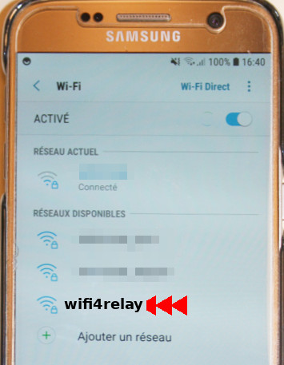
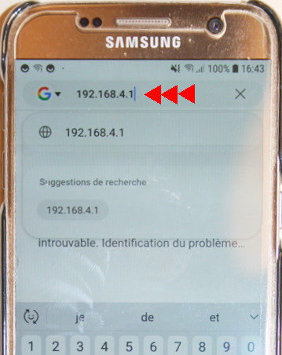
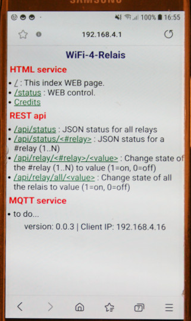
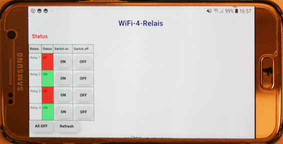

This file also [exists in English](readme_ENG.md)

# wifi-4-relais - Module 4 Relais + Raspberry-Pi Pico pour realiser des objets IoT

Bienvenu dans ce nouveau projet éducatif de [MCHobby](https://shop.mchobby.be).

Le projet WiFi-4-relais associe une [carte 4 relais opto-isolée](https://shop.mchobby.be/fr/relais-modules/632-module-quatre-relais-3232100006324.html) avec un [Raspberry-Pico W](https://shop.mchobby.be/fr/pico-rp2040/2434-pico-w-wireless-rp2040-2-coeurs-wifi-bluetooth-3232100024342.html).


De façon surprenante, cette configuration offre de nombreuses possibilités pour les Makers désirant créer des projets personnalisés (sans se prendre la tête sur la sélection  matérielle). Cette configuration permet de créer des projets _push-push change-over_ (pousser une fois pour activer, pousser une autre fois pour désactiver), activation minutées, un marche/arrêt par horodateur, ajouter des capteurs pour contrôler la température ou l'humidité, etc).


Si vous ne connaissez pas encore le Raspberry-Pi Pico sous MicroPython, je vous suggère la lecture de l'ouvrage "[Raspberry-Pi Pico & Pico W - la programmation Python sur microcontrôleur avec MicroPython](https://www.editions-eni.fr/livre/raspberry-pi-pico-et-pico-w-la-programmation-python-sur-microcontroleur-avec-micropython-9782409038754)" paru aux éditions ENI.

## Fonctionnalités du projet:
* Mise sous tension avec [Raspberry-Pi Pico W](https://shop.mchobby.be/fr/pico-rp2040/2434-pico-w-wireless-rp2040-2-coeurs-wifi-bluetooth-3232100024342.html)
* __[MicroPython](http://www.micropython.org/)__ et Open-Source: modifiez le code en fonction de vos besoins.
* Carte contrôleur: mise en oeuvre rapide du projet. Selon vos besoins et encombrement...<br />Branchez la carte contrôleur:
 * directement sur la carte relais
 * à l'aide d'une nappe de fils sur la carte relais
* Contôle local: Les 4 boutons utilisateurs peuvent être utilisés pour contrôler directement les relais (ou autres tâche souhaitée). De multiples changement d'état d'un même relais ne peut se faire à moins de 250ms (1/4 de seconde)!
* Serveur WEB intégré: un petit serveur web est intégré au projet pour expérimenter le contrôle à distance
 * Serveur HTML pour contrôler les relais
 * API REST pour contrôler les relais et obtenir/modifier leur statut avec un contenu JSON.
* Bouton Reset: Un bouton bien pratique pour redémarrer un projet (ou téléverser votre propre firmware).
* Alimentation: vie micro-USB ou bornier/
* Connecteur I2C Qwiic/StemmaQT: ajoutez facilement des capteurs sur projet avec les propduit Qwiic fr Sparkfun ou StemmaQT Adafruit sensors
* [Connecteur UEXT](https://shop.mchobby.be/fr/138-uext): port d'extension I2C/SPI/UART/3V. Solide et fiable, ce connecteur IDC 10 broches (empattement 2.54mm) est idéal pour créer vos extensions ou utiliser les modules _industrial grade_ produits par Olimex Ltd.

## Limitations:
* __Ne fonctionne qu'en HTTP uniquement__ (pas de support HTTPS)
* Les réponses du WebServer peuvent prendre plusieurs secondes (soyez patient, c'est un microcontrôleur)
* Nécessite de se connecter sur le Pico pour effectuer la configuration WiFi.

## Révision
* 0.0.5 : apr 12, 2023 - activation de DupTerm sur UART(0) lorsque IN1 est pressé durant le démarrage.
* 0.0.4 : feb 23, 2023 - Configuration du Mode WiFi sur None, "AP", "STA". Surcharge/modifiabe au démarrage avec IN2, IN3, IN4.
* 0.0.3 : aug 4, 2022 - implémentation de l'API REST
* 0.0.2 : aug 1, 2022 - implémentation du Service HTML

# Découvrir

## Navigateur Internet
Lorsque le projet démarre, il est configuré pour démarrer comme point d'accès (il crée son propre réseau WiFi). Vous aurez bespo, de connecter votre SmartPhone ou votre ordinateur sur le réseau "__wifi4relay__" créé par le Pico Wireless.



Ensuite saisir le mot de passe par défaut pour ce WiFi "__w4r294arrow__".


En utilisant votre bavigateur internet, vous pouvez naviguer débuter une navigation sur l'adresse IP __http://192.168.4.1__ .



Une fois connecté, vous verrez apparaître la page d'accueil de l'application (index).



Sur la page d'accueil, cliquer sur le lien "__/status__" qui affiche la page de contrôle WEB.




## Session REPL (via USB-Serie)

Lorsque le projet démarre, il affiche différentes information sur la ligne USB/Série. Pendant le fonctionnement du serveur WEB, celui-ci affiche également les changements d'états des relais.

Vous pouvez capturer ces messages à l'aide de ThonnyIDE, Putty, MPRemote, RShell. Avec la connexion USB/Série établie pressez CTRL+C (pour arrêter le script MicroPython et voir l'invite de commande >>> ) puis pressez CTRL+D (Reboot à chaud). Cela permet de redémarrer le Pico Wireless sans réinitialiser la connexion série via USB.

Voici un exemple de ce qui peut être vu sur la connexion USB/Série connexion.

```
MicroPython v1.19.1 on 2022-09-13; Raspberry Pi Pico W with RP2040
Type "help()" for more information.
>>>
MPY: soft reboot
WiFi_Mode = AP
Starting main.py
version: 0.0.4
Initializing hardware!
Current Network config
<CYW43 AP up 192.168.4.1>
Starting WebServer
Action ON2
Action ON4
Action ALL_OFF
Action ON2
```

Ces informations peuvent être très utiles lors d'une recherche d'anomalie.

# Démarrage et configuration

Le configuration est stockée dans le fichier `wifi_cfg.py` (contenu auto-descriptif).

L'élément clé de cette configuration est le `WIFI_MODE` qui stipule comment le module WiFi doit être configuré:
* Inactif (None).
* Configuré en point d'accès ("AP") pour créer son propre réseau WiFi.
* Configuré en mode Station ("STA") pour se connecter sur un réseau WiFi existant.

Le projet est configuré par défaut en Point d'Accès (`"AP"`) comme indiqué dans le paramètre `WIFI_MODE`.

Le `WIFI_MODE` peut être surchargé en pressant l'un des bouton de la carte contrôleur durant le démarrage (voir "Démarrage en détail"). Cette approche est pratique pour tester la configuration du mode Station ("STA") au boot sans modifier immédiatement la valeur de `WIFI_MODE`.

Le contenu du fichier est auto-descriptif. A noter que le mode Station (utilisé pour se connecter sur un WiFi existant) peut aussi accepter une adress IP statique (à la place de dynamique avec DHCP) si la ligne `STATIC_IP` est rendue active en enlevant le caractère # en début de ligne.

```
# WiFi mode:
# ----------
#   None = No Wifi Activation,
#   "AP" = Access-Point,
#   "STA" = Station
WIFI_MODE = "AP"

# -- station config --
WIFI_SSID = "MY_WIFI_SSID"
WIFI_PASSWORD = "MY_PASSWORD"
# Uncomment to define static IP (instead of DHCP) for Station mode
# tuple is defined with (Static_IP, Network_mask, gateway, dns_server)
#STATIC_IP = ('192.168.1.200','255.255.255.0','192.168.1.1','192.168.1.1')

# -- Access Point config --
AP_SSID = "wifi4relay"
AP_PASSWORD = "w4r294arrow"
```

En cas de problème de configuration, il est possible de récupérer les fichiers `wifi_cfg.py` et `boot.py` initiaux peuvent être restaurés depuis les sources GitHub.

Le fichier `wifi_cfg.py` doit être modifié et copié sur votre carte.

1. Ouvrir le fichier [examples/wifi_cfg.sample](examples/wifi_cfg.sample) et fixer les valeurs des constantes `WIFI_SSID` (nom du réseau) et `WIFI_PASSWORD` pour la connexion en mode Station. Vérifiez deux fois!
2. Renommez le [examples/wifi_cfg.sample](examples/wifi_cfg.sample) sous `wifi_cfg.py`
3. Copiez `wifi_cfg.py` sur votre carte.
4. Renomez le fichier [examples/boot.timeout.sample](examples/boot.timeout.sample) sous `boot.py`. Ce fichier établit la connexion WiFi (avec un timeout de 40 secondes).
5. Copiez le fichier `boot.py` sur votre carte.

__Remarque:__
* Si la configuration en mode station est incorrecte (mauvais SSID ou mauvais mot-de-passe) alors le fichier `boot.py` bloquera le démarrage pendant 40 secondes max (timeout de connexion).<br />Après 40 secondes, `boot.py` interrompt son exécution en faisant clignoter la LED (code d'erreur) puis passe à l'exécution de `main.py`.

Vous pouvez effacer le fichier boot depuis une session REPL à l'aide des commandes suivantes:
```
>>> import os
>>> os.remove("boot.py")
```

Puis recommencer la configuration.

## Démarrage en détails

Au démarrage, le Pico exécute le fichier `boot.py` qui gère la configuration WiFi.
* Il essaye de charger `wifi_cfg.py`. Si le fichier est inexistant alors le `WIFI_MODE` est `None`. Sinon le `WIFI_MODE` provient du fichier `wifi_cfg.py`.
* Vérifie si le bouton IN1 est pressé. Si c'est le cas, alors le terminal REPL est dupliqué sur UART(0) avec GP0=tx, GP1=rx  @ 115200 bauds.
* Ensuite il vérifie si IN2, IN3 ou IN4 est pressé. Le `WIFI_MODE` est modifié si l'un des boutons est pressé
 * IN2 : force le mode à "STA"
 * IN3 : force le mode à "AP"
 * IN4 : force le mode à None
* Allumer la LED du Pico __une fois__ pendant 100ms
* Démarrer le module WiFi en fonction du mode `WIFI_MODE`
 * SI `WIFI_MODE` = "STA" alors utiliser la configuration `WIFI_xxx` et `STATIC_IP` pour se connecter sur un reseau WiFi existant (execute `sta_connect()`).<br />Le timeout de connexion est de 40 secondes.
 * SI `WIFI_MODE` = "AP" alors utiliser la configuration `AP_xxx` pour créer un réseau WiFI sur 192.168.4.1
* Les LED du PICO s'allume  __seulement lorsque__ le réseau WiFi est configuré et actif
* En cas d'erreur, la LED affiche un code d'erreur lumineux avec la LED.<br />Flashs rapide suivit d'un code (nombre de clignotement lent). Le code d'erreur est répété 3 fois
 * 1 blink : erreur/timeout de connexion en mode Station.
* Fin d'exécution de `boot.py`

Lorsque `boot.py` achève sont exécution, MicroPython démarre le script `main.py`.

Le script `main.py` est responsable de l'implementation du serveur WEB.
* SI le mode WiFi est différent de "AP" ou "STA" ALORS `main.py` termine son exécution à l'aide d'un `sys.exit()`
* Lorsque le Serveur WEB est en fonctionnement, celui-ci peut être arrêté en pressant la combinaison de touche CTRL+C (dans REPL)

## Surcharge du mode de démarrage

Il est possible de forcer `WIFI_MODE` manuelklement durant le démarrage. Ce mode restera actif jusqu'au prochain redémarrage de la carte.


Si `None` est sélectionné alors la séquence de démarrage est interrompue et le serveur WEB n'est pas démarré. Par conséquent, la session REPL MicroPython est librement accessible via la connexion USB-Série.

## Obtenir REPL via un UART série

Lorsque le projet est en cours de fonctionnement, il peut être relativement difficile d'obtenir une session REPL via la connexion USB.

En démarrant la carte en pressant le bouton IN1, le fichier de configuration réplique la session REPL sur UART(0) . Cette connexion matérielle est plus fiable.


L'UART(0) en 3.3V est disponible sur les deux premières broches du Pico.


L' UART(0) est également disponible sur le connecteur UEXT comme l'indique de graphique ci-dessous. Ce connecteur sera bien pratique pour y connecter un [câble console](https://shop.mchobby.be/product.php?id_product=144) ou un [FTDI-Friend](https://shop.mchobby.be/product.php?id_product=77).


# Client Réseau (mode Station)
Lorsquele `WIFI_MODE` est configuré eb `"STA"` le Pico Wireless se connecte sur un réseau WiFi existant, comme n'importe quel ordinateur le fait. De la sorte, le Pico Wireless obtientdra une adresse IP dynamique via DHCP (IP qu'il faudra identifier) ou peut être configuré pour avoir une adresse IP statique (IP Fixe, plus facile à retrouver/mémoriser)

Naviguer sur `http://<IP-of-Board>` affichera la page d'accueil avec les différentes options.


Depuis cette page, l'utilisateur peut suivre les différents liens pour découvrir les possibilités.

# Détails techniques

## Schéma


## Web App Workflow
Naviguer sur le lien `http://<IP-of-Board>/status` permet d'affichier l'état des relais et permet à l'utilisateur de changer l'état d'un relais.


Les boutons ON/OFF son toujours accessibles (puisque l'état physique du relais pourrait avoir changer par une action utilisateur sur l'un des boutons INx).

En pressant l'un des boutons de la page WEB, la commande est envoyée vers le serveur WEB qui génère une nouvelle page de statu. Une petite animation CSS est affichée pendant que le le serveur WEB traite la requête (ce qui peut prendre plus de 10 secondes).


L'animation évite de multiples appels sur le serveur WEB pendant qu'il exécute le requête en cours.

## API REST

L'API REST est idéale lorsque vous voulez utiliser le projet ocomme objet distant.


Voici les differentes URL disponible sur l'API REST.

| URI                         | Description                                              |
|-----------------------------|----------------------------------------------------------|
| /api/status                 | Statut de tous les relais sous forme d'une structure JSON.          |
| /api/status/<#relay>        | Statut du relais #relay (1..N) au format JSON.                      |
| /api/relay/<#relay>/<value> | Changer l'état du relais #relay (1..N) vers la valeur (1=on, 0=off) |
| /api/relay/all/<value>      | Changer l'état de tous les relais vers la valeur (1=on, 0=off)      |

L'exemple suivant permet d'obtenir l'état de de tous les relais. Le dictionnaire contient l'identication du relais (#relay) et son état actuel (1:on, 0:off).


Ce qui correspond à la structure JSON suivante:

`{"1": 0, "4": 0, "3": 0, "2": 1}`

Pour une requête d'état concernant un seul relais, le dictionnaire en réponse est réduit à une seule entrée.


Ce qui produit la structure JSON suivante (le relais 2 est actif/ON):

`{"2": 1}`


## Implémentation MQTT

**Pas encore fait**

# Comment installer

## Connexion WiFi

L'implémentation initiale ne permet de configurer la connexion WiFi via une interface WEB.

Comme déjà expliqué précedemment, le WiFi doit être configuré en éditant et copiant les fichiers:
* [examples/wifi_cfg.sample](examples/wifi_cfg.sample) ==> `wifi_cfg.py`
* [examples/boot.timeout.sample](examples/boot.timeout.sample)  ==> `boot.py`

## Elements WEB (HTML, JSON, REST)
L'installation est relativemennt simple.
1. Créer un répertoire `lib` sur votre carte.
2. Copiez les fichiers `lib/*.py` dans le répertoire `lib` de votre carte.
3. Créer le répertoire `www` sur la carte.
4. Copier les fichiers `www/*.*` dans le répertoire `www` de la carte.
5. Copiez le fichier `main.py` sur la carte. `main.py` sera automatiquement exécuté lors du prochain redémarrage de la carte (ou de MicroPython).

Remarque: si vous désirez un meilleur contrôle de votre carte durant la phase de test, vous pouvez renommer le fichier `main.py` vers `test.py` avant de le copier sur votre carte. Ensuite, le serveur WEB peut être démarrer à la demande en saissisant la commande `import test` depuis la session REPL.

## Installation MQTT
MQTT ne fonctionne pas de la même façon qu'un serveur WEB. MQTT n'est donc pas une surcouche sur un serveur WEB.

Par conséquent, cela ne s'installe pas de la même façon non plus ;-) .

**Pas encore fait**

# TODO
* Breakout des bouton utilisateurs
* Configuration du mode Station depuis le mode point-d'accès
* Nommer la carte (et stocker l'information)
* Nommer les relais (et stocker l'information)
* Support MQTT
* Support SSL
* Authentification utilisateur
* Configurer l'action relais: Toggle / trap-Timer

# Ressources
* [MicroWebSrv](https://github.com/jczic/MicroWebSrv) - Micro Web Server pour MicroPython
* [microdot](https://github.com/miguelgrinberg/microdot) - framwork web minimaliste pour microcontrôleur (MicroPython) inspiré de Flask (utilise également AsyncIO)

# Liste d'achat
* [WiFi-4-Relais kits](https://shop.mchobby.be/product.php?id_product=2473)
* [Raspberry-Pico W](https://shop.mchobby.be/fr/pico-rp2040/2434-pico-w-wireless-rp2040-2-coeurs-wifi-bluetooth-3232100024342.html).
