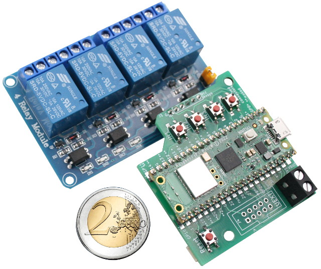
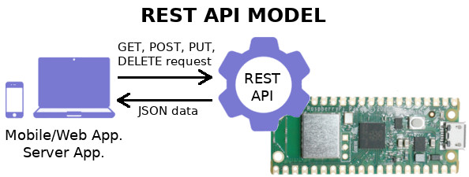

This file also exists in [French](readme.md)

# wifi-4-relais - 4 Relay Modules + Raspberry-Pi Pico to build WiFi IoT device

Welcome to this new educative projet created by [MCHobby](https://shop.mchobby.be).

The WiFi-4-relais project associate a [4 relay board (opto-isolée)](https://shop.mchobby.be/fr/relais-modules/632-module-quatre-relais-3232100006324.html) with a [Raspberry-Pico W](https://shop.mchobby.be/fr/pico-rp2040/2434-pico-w-wireless-rp2040-2-coeurs-wifi-bluetooth-3232100024342.html).



Suprisingly, this basic setup offers a lot of possibilities for makers wanting to creates custom projets without getting bored with hardware stuff. The current setup would allow projects like push-push change-over, timer activation, scheduled on/off, adding sensors & controling temperature or humidity, etc).

## Project features:
* Powered with [Raspberry-Pi Pico W](https://shop.mchobby.be/fr/pico-rp2040/2434-pico-w-wireless-rp2040-2-coeurs-wifi-bluetooth-3232100024342.html)
* __[MicroPython](http://www.micropython.org/)__ & Open-Source: modify the code to suit your needs.
* Controler board: quick setup of the projet.<br />Depending on your need, connect the controler Board
 * by soldering it directly on the relay board.
 * by using wires to connect to the relay board.
* Local control: the 4 user buttons can be used for direct control over the relay (or what ever you need). Multiple relay changes requires a 250ms delay between them!
* Integrated WebServer: small a light WebServer to experimental remote control
 * HTML server to control the relay
 * REST API to control the relais allowing to get the JSON Status of relay and update them.
* Reset button: Qwick and convenient restart/reboot button
* 5V Power: micro-USB or external terminal
* Qwiic/StemmaQT I2C connector : expand your setup with sensor with Sparkfun & Adafruit sensors
* [UEXT connector](https://shop.mchobby.be/fr/138-uext): I2C/SPI/UART/3V extension port. Strong & reliable 2.54mm 10 Pins IDC connector to expand your project.

## Limitations:
* __Working with HTTP only__ (not HTTPS support yet)
* WebServer response may takes severals seconds (be patient, it is a microcontroler)
* Requires to connect the Pico to setup Wifi configuration.

## Revision
* 0.0.5 : apr 12, 2023 - Activating DupTerm on UART(0) when IN1 pressed at boot.
* 0.0.4 : feb 23, 2023 - Wifi configuration mode None, "AP", "STA". Override at startup with IN2, IN3, IN4.
* 0.0.3 : aug 4, 2022 - REST API implemented
* 0.0.2 : aug 1, 2022 - HTML Service implemented

# Discovering

## Web Browser
When staring the project, it is configured to starts as an Access Point. So you need to connect your SmartPhone or your computer on the "__wifi4relay__" network created by the Pico Wireless.


Then key-in the default WiFi password "__w4r294arrow__".


By using an internet browser, you can access the Web App on the Pico Wireless through the IP Address __192.168.4.1__ .


Once connected, you will see the Web App index page.


From the index page click on the "__/status__" link which display the Web control for the page.


## REPL session (via USB-Serial)

When starting the project it show various information on the USB/Serial line. While running the Web Server, the project also shows state changes.

You can catch them with ThonnyIDE, Putty, MPRemote, RShell. When USB/Serial connexion is established press CTRL+C (to stop current microPython script) followed by CTRL+D (Warm reboot). This restart the Pico Wireless without closing the USB-Serial connection.

Here follows what's displayed over the USB/Serial connection.

```
MicroPython v1.19.1 on 2022-09-13; Raspberry Pi Pico W with RP2040
Type "help()" for more information.
>>>
MPY: soft reboot
WiFi_Mode = AP
Starting main.py
version: 0.0.4
Initializing hardware!
Current Network config
<CYW43 AP up 192.168.4.1>
Starting WebServer
Action ON2
Action ON4
Action ALL_OFF
Action ON2
```

Such information could be very valuable in case of troubleshooting.

# Startup and configuration

The configuration is stored into the `wifi_cfg.py` file (content is self explainatory).

The key item of the configuration is the `WIFI_MODE` which indicates if the wifi is:
* inactivated (None).
* configured as Access Point ("AP") to create its own WiFi network.
* configured as Station ("STA") to connect an existing WiFi network.


The default configuration is the Access Point (`"AP"`) as stated by the parameter `WIFI_MODE`.

The `WIFI_MODE` can be override at startup by pressing one of the input buttons when the microcontroler starts (see "Startup in details"). This is convenient to experiment the Station mode configuration ("STA") at boot before definitively changing the value of `WIFI_MODE` .

The file content is self explainatory. Please note that Station mode (connecting to an existing WiFi network) can also get a Static IP address (instead of DHCP) if `STATIC_IP` line is made available by removing the initial # character.

```
# WiFi mode:
# ----------
#   None = No Wifi Activation,
#   "AP" = Access-Point,
#   "STA" = Station
WIFI_MODE = "AP"

# -- station config --
WIFI_SSID = "MY_WIFI_SSID"
WIFI_PASSWORD = "MY_PASSWORD"
# Uncomment to define static IP (instead of DHCP) for Station mode
# tuple is defined with (Static_IP, Network_mask, gateway, dns_server)
#STATIC_IP = ('192.168.1.200','255.255.255.0','192.168.1.1','192.168.1.1')

# -- Access Point config --
AP_SSID = "wifi4relay"
AP_PASSWORD = "w4r294arrow"
```

In case of configuration trouble, the initial files `wifi_cfg.py` and `boot.py` can still be restored from the GitHub sources.

WiFi must be setup manually by editing & copying the `wifi_cfg.py` file to your board.

1. open the [examples/wifi_cfg.sample](examples/wifi_cfg.sample) file and set `WIFI_SSID` (WiFi network name) and `WIFI_PASSWORD` constants (for Station connexion). Double-check it!
2. Rename the [examples/wifi_cfg.sample](examples/wifi_cfg.sample) as `wifi_cfg.py`
3. Copy the `wifi_cfg.py` to your board.
4. Rename the [examples/boot.timeout.sample](examples/boot.timeout.sample) as `boot.py`. This boot file connects the WiFi Network and waits up to 40 seconds for the connection to be established.
5. Copy the `boot.py` to your board.

__Remark:__
* If the WiFi Station configuration is wrong (bad SSID or bad Password) then the `boot.py` will lock the board at startup for 40 seconds max.<br />After 40 seconds, the `boot.py` exits with blinking error code then switch to `main.py`.


## Startup in details

At startup the Pico does executes the `boot.py` file which manage the WiFi setup.
* It tries to load the `wifi_cfg.py`. If it can't find the file then `WIFI_MODE` is `None`. Otherwise the `WIFI_MODE` comes from the `wifi_cfg.py` file.
* It check the IN1 is pressed. If so, the REPL is dupterm on UART(0) on GP0=tx, GP1=rx  @ 115200 bauds.
* it check if one of  IN2, IN3, IN4 is pressed down. If so, the mode switched to another value
 * IN2 : force the mode to "STA"
 * IN3 : force the mode to "AP"
 * IN4 : force the mode to None
* Blink __once__ the Pico LED for 100ms
* Start the WiFi module accordingly to `WIFI_MODE`
 * If `WIFI_MODE` = "STA" then it use the `WIFI_xxx` & `STATIC_IP` configuration connect to an existing WiFi network (execute `sta_connect()`). The connection timeout is 40 seconds.
 * if `WIFI_MODE` = "AP" then it use the `AP_xxx` configuration to create its own WiFI network on 192.168.4.1
* The Pico Wireless LED light up  __only when__ the WiFi network is bring up.
* Show error blinking pattern (if any error).<br />Flashing followed by a code (slow count of blink). The pattern is repeated 3 times
 * 1 blink : Station connect error/timeout.
* Exits the `boot.py`

When `boot.py` terminates, MicroPython does start the `main.py` script.

The `main.py` script is responsible of the WebServer implementation.
* if the WiFi mode is not "AP" or "STA" then the `main.py` stops its execution with `sys.exit()`
* If the WebServer is running then it can be stopped with a CTRL+C (in REPL)

## Override startup mode

It is possible to MANUALLY force `WIFI_MODE` at boot. This mode will remain active until the next reboot.


In `None` is selected, boot sequence is skipped and the WebServer is not started. As results, the MicroPython REPL is freely available over the USB-Serial.

## Getting REPL over UART-Serial

When running the board, it is quite difficult to establish a REPL session over USB.

Starting the board by pressing the IN1 button will replicate the REPL session over the UART(0) which is more reliable.


The 3.3V UART(0) is available on the two first pins of the Pico.


The UART(0) is also available on the UEXT connector as visible below.


# Network Client (Station mode)
When `wifi_mode` is configured as `"STA"` the Pico Wireless will connect an existing WiFi network as any computer does. As such the Pico Wireless will get a dynamic IP address DHCP (that you must identify) or can be configured with a fixed Static IP (more easy to remember)

Browsing the `http://<IP-of-Board>` will show the welcome page with the various options.


from there, user can browse the various entries and discover the possibilities.

# Technical details

## Schematic


## Web App Workflow
Browsing the `http://<IP-of-Board>/status` will show the relays status and allow the user to change the state of each relay.


The buttons ON/OFF are always available as the relay state can also be changed with the user button on the board.

When pressing a button, the command is sent to the WebServer which generates a new status page. A small CSS animation is displayed while while the WebServer is processing the command.


Animation would avoids multiple calls to the WebServer while it process the current user request.

## REST API

The REST api is suited to interact with the project as a remote object.



Here follows the available URL for the REST API.

| URI                         | Description                                              |
|-----------------------------|----------------------------------------------------------|
| /api/status                 | Status for all relays returned as JSON structure.        |
| /api/status/<#relay>        | JSON status for a #relay (1..N)                          |
| /api/relay/<#relay>/<value> | Change state of the #relay (1..N) to value (1=on, 0=off) |
| /api/relay/all/<value>      | Change state of all the relais to value (1=on, 0=off     |

The following example collects the status of all the relays. The dictionnary contains the identification of the relay (#relay) and its current status (1:on, 0:off).


Which correspond to the following JSON data:

`{"1": 0, "4": 0, "3": 0, "2": 1}`

For a single relay request, the dictionnary will be reduced to a single entry.


with the following JSON data (the relay 2 is ON):

`{"2": 1}`


## MQTT Implementation

**Not done yet**

# How to install

## WiFi connexion

The initial implementation does not setup WEB based configuration. WiFi must be setup manually by editing & copying files to your board.

1. open the [examples/wifi_cfg.sample](examples/wifi_cfg.sample) file and `WIFI_SSID` (WiFi network name) and `WIFI_PASSWORD` constants. Double-check it!
2. Rename the [examples/wifi_cfg.sample](examples/wifi_cfg.sample) as `wifi_cfg.py`
3. Copy the `wifi_cfg.py` to your board.
4. Rename the [examples/boot.timeout.sample](examples/boot.timeout.sample) as `boot.py`. This boot file connects the WiFi Network and waits up to 40 seconds for the connection to be established.
5. Copy the `boot.py` to your board.

__Remark:__
If the WiFi configuration is wrong (bad SSID or bad Password) then the `boot.py` will lock the board starup at most for 40 seconds. After 40 seconds, you will get back the hand over the REPL (running over the USB-Serial line).

You can then drop the boot file from REPL with the following REL commands:
```
>>> import os
>>> os.remove("boot.py")
```

Restart again the configuration.

## WEB based (HTML, JSON, REST)
The installation is quite simple.
1. Create a `lib` folder on your board.
2. Copy the `lib/*.py` on the `lib` folder of the board.
3. Create a `www` folder on the board.
4. Copy the `www/*.*` files on the `www` folder on the board.
5. Copy the `main.py` file to the board. `main.py` will be automatically executed at next power cycle.

Remark: if you want a better control during the testing phase, you can rename the file `main.py` to `test.py` while copying to the board. Then the WebServer can be started on demand from REPL by entering the command `import test` dans la session REPL.

## MQTT based
MQTT is not working the same as a WebServer. So it not build on a top of a WebServer.

As a results, it does'nt install the same way neither ;-) .

**Not done yet**

# TODO list
* Breakout the user buttons
* WiFi Station setup configured via Access Point
* Name the board (and store it)
* Name the relais (and store it)
* MQTT support
* SSL support
* User auth
* Configure relay action: Toggle / trap-Timer

# Ressources
* [MicroWebSrv](https://github.com/jczic/MicroWebSrv) - Micro Web Server for MicroPython
* [microdot](https://github.com/miguelgrinberg/microdot) - minimalistic web framework for microcontroler (MicroPython) inspired by Flask (also use AsyncIO)

# Shopping list
* [WiFi-4-Relais kits](https://shop.mchobby.be/product.php?id_product=2473)
* [Raspberry-Pico W](https://shop.mchobby.be/fr/pico-rp2040/2434-pico-w-wireless-rp2040-2-coeurs-wifi-bluetooth-3232100024342.html).
